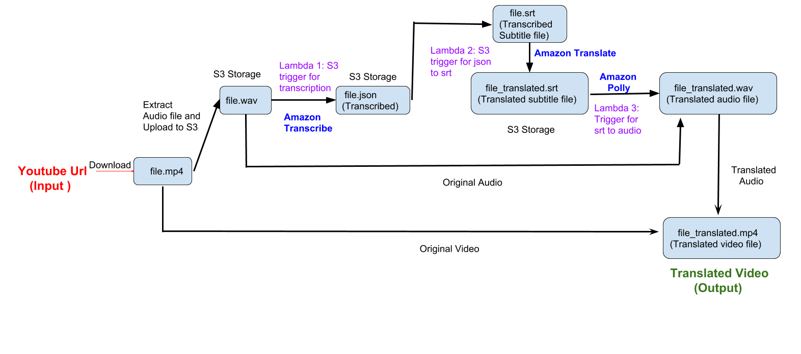

## AI Automated dubbing : End to end Youtube audio Translation Platform using AWS serverless architecture (AWS lambda)
Imagine watching any youtube video (eg: Documentary) with audio in your native language irrespective of what its original language was.
This is an end to end video translation platform using AWS AI services that just does that in one click without human intervention.

### Input:
The input to the program is a youtube video url link in any language. Works best for single speaker videos (Eg: Documentaries, Monologues etc). Currently only English and Spanish input languages are supported by Amazon Transcribe.
So input youtube url link should be in English(US) or Spanish(US).
 
But if you adapt this to Google cloud services you could work with many other languages.
 
### Output
The output is a downloaded video with the audio track modified in the language of your choice.

A demo can be seen here:
https://www.youtube.com/playlist?list=PLeIs-OgljgIwCJwJUFqWTRZVzM0VTyT4D

Here we are converting an English (USA accent) documentary into different languages (Spanish and Russian)  different accents (English - Indian).

**1st Video :** Original English Audio (American Accent)
**2nd Video :** Translated English Audio (Indian Accent)
**3rd Video :** Translated into Spanish Audio
**4th Video :** Translated into Russian Audio


Another demo can be seen at:
https://www.youtube.com/playlist?list=PLeIs-OgljgIyrYeAp7K26I88KfOePJHu4

In this demo you can see a playlist with two videos.  
**1st Video :** English Original Audio  
**2nd Video :** Translated Audio in Chinese (English subtitles available generated using Amazon Transcribe)

# Important
Replace the video_translate_credentials.csv in the repository with your own credentials file that has permissions to use the services in AWS that are called.

Create appropriate S3 buckets with the bucket names in Jupyter ipython notebook. Will be evident once you look at the code in jupyter notebook.


# Installation
[Create a conda environment.](https://conda.io/docs/user-guide/tasks/manage-environments.html#creating-an-environment-with-commands)
Clone this repository and switch to the conda environment created.
Once inside the environment run:
```
$ pip install -r requirements.txt

```
# Running the code

Once you are done with installation of requirements.txt above, run the following command in the terminal:
```
$ jupyter notebook

```

Then open the ipython notebook 
**end_to_end_video_translation.ipynb**.

Change the **two parameters** highlighted below in the file accordingly to your input video and expected output language.  

Allowed  codes for original language: 'en-US' (English USA) and  'es-US' (Spanish USA)  
**original_language_code = 'en-US'**  

Allowed codes : en - English, es - Spanish, zh - Chinese, fr - French, ru - Russian , de - German , it - italian, 
tr - Turkish, ja - Japanese, pt - Portugese  
**translated_language_code = 'zh'**

Then run all cells. It will prompt for a youtube url that you want to translate after the first cell.
Enter any youtube url that you want to translate eg: https://youtu.be/UzZFdEY4vJ0

Wait for processing to be done and find the translated video file(.mp4) in the same folder.

Most of the processing is done in the 3 lambda functions that are called as part of the execution.
Only video and audio stitching are done locally.

Everything should run well but if you encounter any ffmpeg errors,
install [ffmpeg](https://www.ffmpeg.org/)

# Algorithm
**Services used:** Amazon Transcribe, Amazon Translate, Amazon Polly, Lambda (3 different S3 lambda triggers).



**Step 1:** Once a youtube url is entered the video file(.mp4) is downloaded locally , 
audio file (.wav) is separated from it. Only the audio file is uploaded to S3 bucket.
 
**Step 2:** As soon as the audio file(.wav) is uploaded to S3 bucket, the S3 trigger starts a **Amazon Transcription** job in lambda. This is the first lambda function.
 Shown in **lambda1_s3_trigger_transcription** folder in this repository.
 
 **Step 3:** Once transcription is done, the output json file is stored in another S3 bucket.
 A new S3 trigger starts a lambda function that converts **json to subtitle(.srt)** and also uses **Amazon Translate** to convert the **original** transcribed subtitle(.srt)
 file to **translated** subtitle (srt) file. This is the second lambda function.
 Shown in **lambda2_json_to_srt** folder in this repository.
 
 **Step 4:** Once the translated srt file is available in S3 bucket, an S3 trigger starts
 another lambda function. This lambda function does two jobs.  
 **1)** First it uses the translated subtitle file to mute out the audio in the original audio file(.wav) at the timeframes available in translated subtitle file. This essentially mutes the voice in the original audio file and preserves any other areas where there was music or background noise.  
 **2)** Using **Amazon Polly**, voice is synthesized for every line in the translated subtitle
 file and overlayed onto the original voice muted audio from step 1 above. Here "max duration" parameter from ssml is used to make sure that
 the translated and synthesized voice of polly doesn't exceed the duration of the original language subtitle duration.
   This is the third lambda function.
 Shown in **lambda3_srt_to_audio** folder in this repository.
 
 **Step5:** The final audio file(.wav) with polly synthesized voice overlayed is downloaded. The audio in original video is replaced with this translated
 audio and a new translated video(.mp4) is  generated locally.
 
 
 
